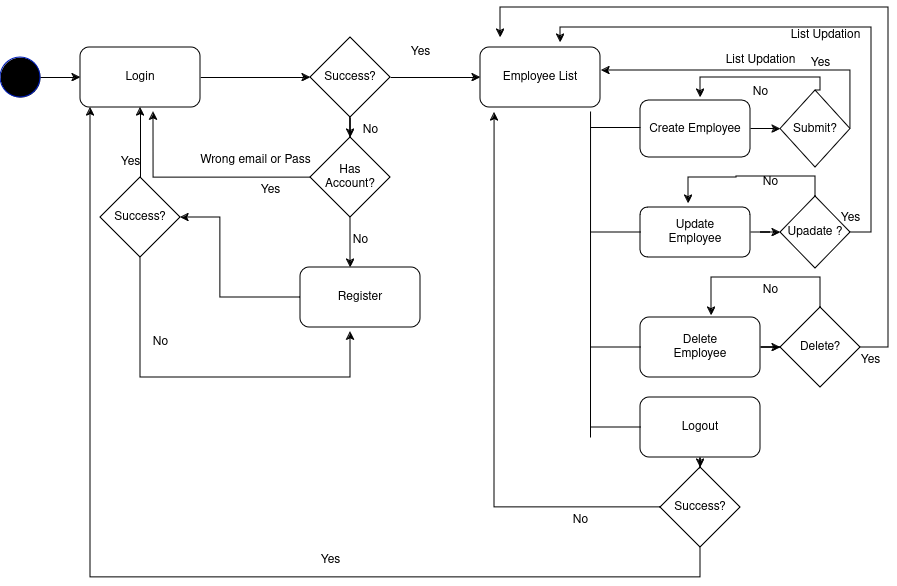

# Backend: (Django) - Project for Assesment

**About this System**
```text
This is a simple web app which is basically built by focusing on backend.
Key Features ot this Web App :
1. Register
2. Login and Logout
3. Add Employee
4. Edit Employee Information
5. Delete Employee
```

**Brief Description of the App**
```text
1. User Authentication
Login, Register and Logout are implemented to authenticate users. A new user must have to create an account and
then login to access the employee information.

2. Database Migrations  
There were created models for four table and those tables are :
  a. Employees Table : This table contains name, email, phone, address and department id of employee.
  b. Departments Table : This table contains department name and id.
  c. Achievements Table : This table contains id and nae of the achivement(s).
  d. Pivot Table : This table is for associating employees with achievement(s).

3. Model Relationship
There are basically two model relationship were established : 
  a. One to one between Department and Employee
  b. Many to many between Employee and Achievement

4. Views/Controllers
Most focused features of django views are:
  a. Employee List : Retrive the employee name, department and achievements.
  b. Create Employee : Creates new employee with name, department and achievements.
  c. Update Employee : Update the employee's name, department, and associated achievements.
  d. Delete Employee : Delete employee from database.

5. Database
 Database : SQLite relational database
 Operation : Django ORM 
```

**Class Diagram of the System**
```plaintext
+-------------------+       +---------------------+
|    Department     |       |      Achievement    |
+-------------------+       +---------------------+
| - id: Integer     |       | - id: Integer       |
| - name: String    |       | - name: String      |
+-------------------+       +---------------------+
         | 1                             | *
         |                               |
         |                               |
         |                               |
         | *                             | *
+-------------------+       +---------------------------+
|     Employee      |       |      AchievementEmployee   |
+-------------------+       +---------------------------+
| - id: Integer     |       | - id: Integer             |
| - name: String    |       | - achievement: ForeignKey |
| - email: String   |       | - employee: ForeignKey    |
| - phone: String   |       | - achievement_date: DateTime |
| - address: String |       +---------------------------+
| - department: ForeignKey |
+-------------------+
```
**Simple State Diagram of the System**




**Backend Validation : The crucial step**
```text

The app's functionalities and inputs were validated from backed.
  - Register and Login are validated from backend .
  - Input types(digits for number, non digit in name, valid email), Required Data(name and department can not be empty)
  are validated.
```

**Additional Features**
```text

HTML and CSS based static pages are created for rendering. For rendering raw HTML and CSS is used instead of
frontend frameworks.
Following pages was rendered and design :
- Login
- Register
- Employee List
- Create Employee
- Update Employee
```

**Technology**
```text

Backend : Django
Render : HTML
Database : SQLite
Version Control : Git
```

**Run this web app in local Machine**
```text

1. Download this project from `https://github.com/1707073Jafril/django-employee` and extract if it is necessary.
2. Go to the project folder `EmployeeManagement`.
3. Open terminal in the project folder and excute the following commands sequentially:
```
 ```bash
python manage.py makemigrations
```
  - Execute `python manage.py makemigrations`
  - Excute `python manage.py migrate`
```text  
4. Add Departments from the Django Shell : Run commands sequentially 
  - `python manage.py shell`
  - `from employee.models import Department`
  - Department.objects.create(name='HR')
  - Department.objects.create(name='Engineering')
  - Department.objects.create(name='Marketing')
More department can be added via run the command : `Department.objects.create(name='dept_name')`
  - exit()

5. Execute `python manage.py runserver`
6. The app will start and you can use features of this app.
```
# Run this web app in local Machine

## Requirements
- Python
- Django

## Installation

1. Clone the repository:
    ```bash
    git clone <repository-url>
    cd EmployeeManagement
    ```

2. Create a virtual environment:
    ```bash
    python -m venv venv
    source venv/bin/activate  # On Windows use `venv\Scripts\activate`
    ```

3. Install dependencies:
    ```bash
    pip install django
    ```

4. Run migrations:
    ```bash
    python manage.py migrate
    ```

5. Create a superuser:
    ```bash
    python manage.py createsuperuser
    ```

6. Start the development server:
    ```bash
    python manage.py runserver
    ```
